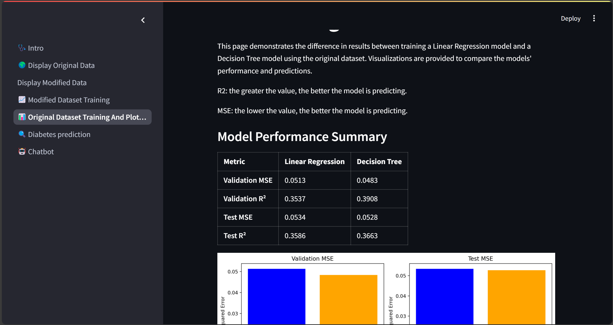
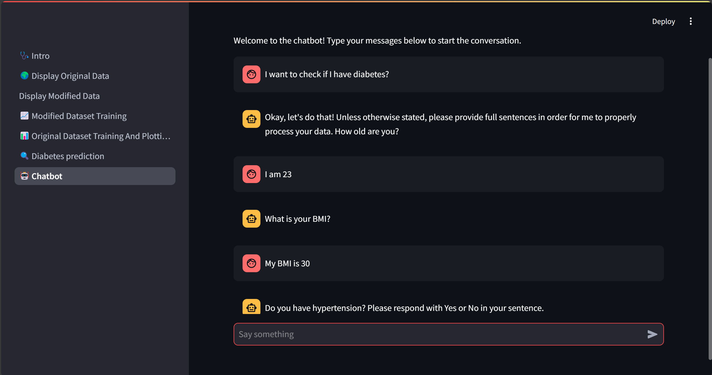
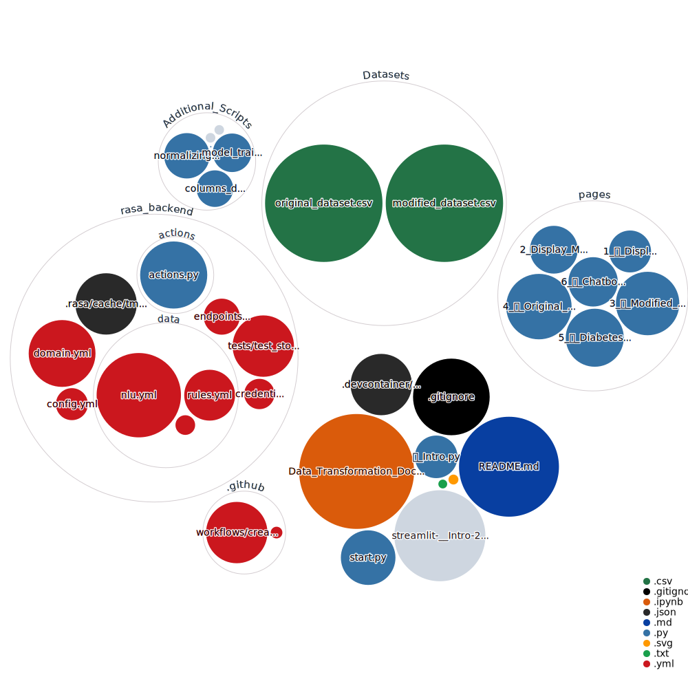

# <div align="center">Diapredictor: Diabetes Risk Assessment & Insights</div>

<p align="center">
  <a href="https://github.com/FaresM7/DiaPredictor">
    
  </a>
  <a href="https://www.python.org/downloads/release/python-310/">
    
  </a>
  <a href="LICENSE">
    
  </a>
</p>

<h4 align="center">
DiaPredictor is a comprehensive web application—originally developed as a university project—designed to help individuals assess their diabetes risk and receive personalized recommendations. It leverages data analysis, machine learning, and a conversational chatbot interface to provide actionable health insights.
</h4>

---

## Table of Contents

- [Project Description](#project-description)
- [Screenshots](#screenshots)
- [Key Features](#key-features)
- [Installation](#installation)
  - [Prerequisites](#prerequisites)
  - [Installation Steps](#installation-steps)
- [Data Overview](#data-overview)
  - [Original Dataset](#original-dataset)
  - [Data Analysis Before Transformation](#data-analysis-before-transformation)
  - [Data Cleaning and Handling](#data-cleaning-and-handling)
  - [Transformations Applied to Original and Modified Datasets](#transformations-applied-to-original-and-modified-datasets)
  - [Post-Balancing Observations](#post-balancing-observations)
- [Repository Visualization](#repository-visualization)
- [Chatbot Implementation with Rasa and Streamlit](#chatbot-implementation-with-rasa-and-streamlit)  
  - [Chatbot Interface (Streamlit + Rasa)](#chatbot-interface-streamlit--rasa)  
  - [Chatbot NLU (Natural Language Understanding)](#chatbot-nlu-natural-language-understanding)  
  - [Actions (Custom Logic)](#actions-custom-logic)
  
---

## Project Description

**Diapredictor** provides an easy-to-use interface for individuals to assess their diabetes risk. The system is built on a robust dataset that has been cleaned and enriched with synthetic data to improve model accuracy.

The project features include:

- **Original vs. Modified Dataset Comparison**: View and analyze the differences between raw and enriched data.
- **Machine Learning Model Evaluation**: Compare performance metrics between models trained on different datasets.
- **Chatbot Assistant**: Receive personalized health advice and diabetes risk assessments.
- **Predictor System**: Input your health data and receive an immediate risk analysis.

The system is implemented using:

- **Streamlit** for an interactive frontend.
-**Scikit-Learn** for training and evaluating models.
- **Rasa** for an AI-powered chatbot.

---

## Screenshots




---

## Key Features

1. **Diabetes Risk Prediction**  
   - Users can input personal health metrics (e.g., age, BMI, glucose levels, smoking status).  
   - The model predicts the likelihood of diabetes and provides actionable health recommendations.  

2. **Comparative Model Analysis**  
   - Evaluate different models trained on both the original and enriched datasets.  
   - Metrics include **accuracy**, **precision**, **mean squared error (MSE)**, and **R² score**.  

3. **Chatbot Assistance**  
   - AI-powered chatbot offers real-time insights on diabetes risk, prevention, and lifestyle changes.  

4. **Data Preprocessing & Augmentation**  
   - **Imbalanced dataset?** We applied **SMOTENC** to generate synthetic minority class samples.  
   - Features like **gender, smoking history, and outliers** were handled for optimal model training.  

---

## Installation

### Prerequisites:

- **Python**: version 3.10
- **Git**: For cloning the repository and managing submodules.

### Installation Steps
1. Clone the repository:
   ```bash
   git clone https://github.com/FaresM7/DiaPredictor.git
   ```
2. Create a virtual environment with Python 3.10
   ```bash
   py -3.10 -m venv venv
   source venv/bin/activate   # On Windows use `venv\Scripts\activate`
   ```
3. Install the required dependencies
   ```bash
   pip install -r requirements.txt
   ```
4. Run the application
   ```bash
   python start.py
   ```
5. In case you were not redirected to the Streamlit pages you can open your browser and navigate to:
http://localhost:8501

---

## Data Overview

### Original dataset

We used the [Diabetes prediction dataset](https://www.kaggle.com/datasets/iammustafatz/diabetes-prediction-dataset) from Kaggle for training the models and later enhance the dataset.

> [!NOTE]
> This dataset is used strictly for educational and demonstration purposes.


### Data Analysis Before Transformation
Initial data visualization revealed the following:
- A slight drop in diabetes cases between ages 60–70, followed by a sharp increase at 80+.
- Minimal differences in diabetes cases between males and females.
- Nearly symmetrical distribution with minimal differences between mean and median values.
- Quartiles exhibited expected variations across attributes.

### Data Cleaning and Handling
- **Incomplete Data:** Removed incomplete examples using Pandas. Labels were verified to ensure direct labeling.
- **Balancing:** The dataset originally had a 10:1 imbalance favoring non-diabetic cases.
  - **Downsampling:** Majority class reduced to 20% (1:2 ratio).
  - **Oversampling:** SMOTENC (Synthetic Minority Over-sampling for Nominal and Continuous data) was applied to the minority class to balance the dataset while addressing potential overfitting concerns.

### Transformations Applied to Original and Modified Datasets
1. **Splitting:** Dataset divided into Training (70%), Validation (15%), and Test (15%) sets. Initial splits showed a 1:3 imbalance for diabetic cases.
2. **Categorical Data Encoding:** Hot-end encoding converted categorical features into binary columns for model training.
3. **Normalization:** Linear scaling normalized feature values, addressing right-skewed distributions (e.g., age). Z-Score standardization was avoided due to non-normal distributions and minimal outliers.
4. **Removal of Unnecessary Attributes:** Attributes with minimal model impact (e.g., gender, certain smoking history categories) were excluded from the modified dataset.

### Post-Balancing Observations
- Diabetes correlation with age showed a zigzag pattern, with a sharp increase in cases at ages 75–80.
- Slight gender differences in diabetes cases remained.
- Blood glucose levels displayed increased variation after SMOTENC, with standard deviation rising from 40.90 to 52.55.
- Quartiles maintained expected variation, with slightly increased spread compared to the original dataset.

---

## Repository Visualization

Below is an automatically generated repository structure diagram. The diagram is updated whenever changes are pushed to the main branch:

<p align="center">
  
</p>

---

> [!WARNING]
> **DiaPredictor is not a substitute for professional medical advice, diagnosis, or treatment.**  
> The diabetes risk assessments and recommendations are for **educational and research** purposes only. Always seek the advice of qualified healthcare professionals for any medical concerns.  
> Use of this application is entirely at your own risk, and the developers assume **no liability** for any actions taken based on its output.

---

## Chatbot Implementation with Rasa and Streamlit

### Chatbot Interface (Streamlit + Rasa)

#### Importing Libraries
- **streamlit**: Builds the chatbot interface.  
- **json**: Handles structured message data.  
- **requests**: Sends requests to Rasa’s REST API.  
- **time**: Introduces wait times for unavailable servers.  

#### Function Definitions

##### check_server_ready()
- Checks if the Rasa server is running via a **GET request** to `/status`.  
- If unavailable, waits **5 seconds** before retrying.  

##### get_bot_response(user_input)
- Sends user input to the Rasa bot (`/webhooks/rest/webhook`).  
- **Processes responses**:  
  - If multiple bot messages exist, extracts and displays all.  
  - If no response, prompts user to rephrase.  
  - If an error occurs, returns a diagnostic message.  

#### Streamlit Page Setup
- Uses `st.set_page_config()` to define **layout** and **title** ("Chatbot Interface").  

#### Server Readiness Check
- Verifies if the Rasa server is **ready** before loading the chat UI.  

#### Displaying Chat History
- Retrieves conversation history from **session state** and displays previous messages.  

#### Handling User Input
- Uses `st.chat_input()` for **message submission**.  
- Saves user messages in **session state** for persistence.  

#### Communicating with the Bot
- Sends user input to `get_bot_response()` and **displays the bot’s reply**.  

#### Displaying Responses
- Uses `st.chat_message()` to display **user and bot messages** dynamically.  

#### Error Handling
- Detects server issues and informs users if the bot is **unavailable**.


### Chatbot NLU (Natural Language Understanding)

#### NLU (Intent Recognition)
- Extracts **intent** (user’s goal) and **entities** (important details).  
- Example:  
  - **Intent**: `"report_illness"` (User feels unwell).  
  - **Entities**: `"symptoms": "fever, headache"`.  

#### Rules (Predefined Responses)
- Define automatic replies for **specific user inputs**.  
- Example:  
  - **User**: "Hello"  
  - **Bot**: "Hi there! How can I help?"  

#### Stories (Conversation Flow)
- Control **multi-step** interactions.  
- Example:  
  - **User**: "I feel unwell"  
  - **Bot**: "Can you describe your symptoms?"  
  - **User**: "I have a headache and fever."  
  - **Bot**: "I recommend rest and hydration. Would you like medical advice?"  


### Actions (Custom Logic)

#### ActionProvideTips
- **Purpose**: Delivers personalized health advice.  
- **How it works**:  
  - Retrieves user conditions (e.g., smoking, hypertension).  
  - Provides **general** (e.g., exercise) and **personalized** (condition-specific) recommendations.  

#### ActionPredictDiabetes
- **Purpose**: Estimates the user’s diabetes risk.  
- **How it works**:  
  - Collects user data (e.g., **age, BMI, glucose**).  
  - Uses a **machine learning model** to predict risk (**low, moderate, high**).  
  - Returns **actionable health tips**.  

#### ActionRememberName
- **Purpose**: Enhances conversations by **remembering user names**.  
- **How it works**:  
  - Extracts name from input and **stores it in a slot**.  
  - If missing, prompts the user to re-enter it.  

